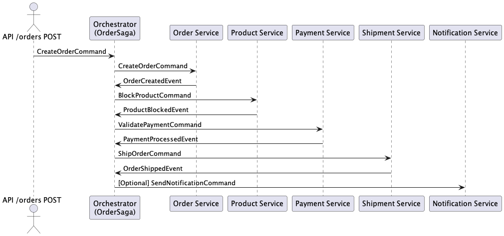
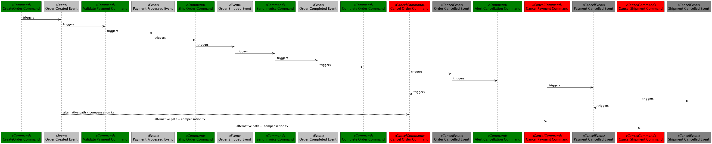

### Notes: 
- Saga design pattern - way to manage consistency across microservices in distributed transaction scenarios.
- Compensating transaction - reverses a failed transaction with a compensating transaction that will return the system to its original state
- Event - this is an object that represents the fact of a change in the state of the system that has already occurred. Events are dispatched when the system has successfully changed its state as a result of a command. Events are typically propagated through an event system, allowing other components to react to changes.
- Command - is an object that contains information about an action to be performed. It expresses the intention to change the state of the system. Commands are typically sent through command buses and processed by command handlers, which make appropriate changes to aggregates or other system components.
- Event Sourcing - application state is restored by repeating a sequence of events, allowing easy reversion to previous states and providing natural integration with messaging systems.
- CQRS: Command - actions that change state; Query - perations that return state but do not modify it. This approach allows you to separate the processing of commands (actions that change state) from queries (read operations), which can improve performance, scalability, and security.

### Used stack:
- Spring Boot
- Axon Framework - event-driven microservices and domain-driven design
- Axon Server - message router and event store

### Sequence diagrams:

#### base microservices flow communication:

### flow with compensation transactions:

#### References
Used video as a source of information: https://youtu.be/pUFGOngzJig
To download axon server: https://developer.axoniq.io/en/axon-server/overview (default path: http://localhost:8024)

